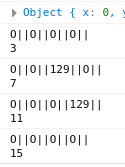
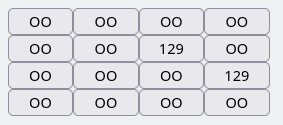

Matching pairs game.
--------------------

You will need to implement a version of the above kid's game but with numbers.

Initially the first file to be filled in (index.js) needs to have a fully working game in the browser console.

You initiallize a game and play with:

```
var game = new Game(4);

game.play(0,1);
game.play(1, 1);

// to check the grid's progress
console.log(game.print_grid);
```
If the 2 Square numbers match then they stay opened. If they dont they both return back to '0'.

Example:



Once there is a fully working version of the console game (in html.js). Instead of having to play through the browser console only each square will be an html button too that will be listening to a click event. Once clicked it s value will be checked (same code as in the console version) and will either return to a blank button or show the pair of same numbers. 
You should get the game dimentions though a browser prompt at the start of the game.

Example:



Bonus stages
============

1) Write tests for the console game with mochajs.
2) Attempt to run in browser tests with selenium for the html version.
